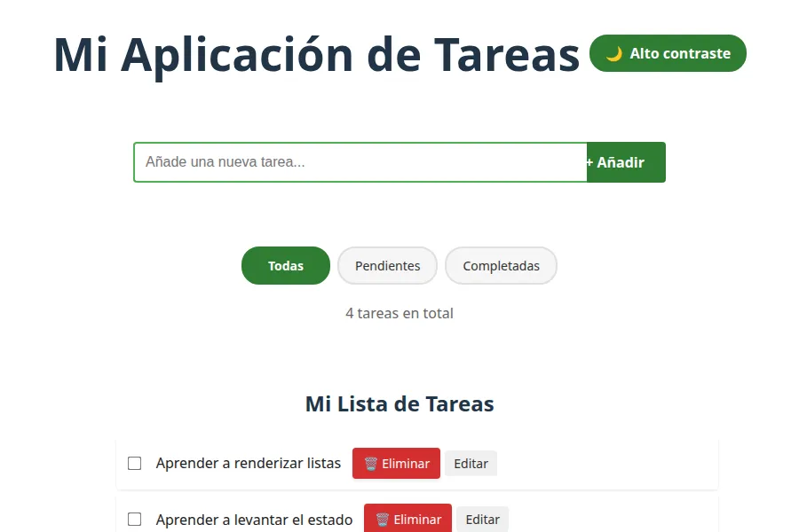

# Mi Aplicación de Tareas (To-Do App)

Este proyecto es una aplicación de lista de tareas (To-Do App) desarrollada con React y Vite. Permite a los usuarios añadir, editar, marcar como completadas y eliminar tareas, así como filtrar la lista por estado. La aplicación también incluye un modo de alto contraste para mejorar la accesibilidad.

## Características

*   **Gestión de Tareas:** Añade nuevas tareas, edita el texto de las existentes, marca tareas como completadas/pendientes y elimínalas.
*   **Filtrado:** Visualiza todas las tareas, solo las pendientes o solo las completadas.
*   **Accesibilidad:** Incluye un modo de alto contraste y atributos ARIA para una mejor experiencia de usuario.
*   **Animaciones:** Transiciones suaves para la entrada, salida y completado de tareas.
*   **Persistencia de Datos:** Las tareas se gestionan a través de una API local simulada con `json-server`.

## Tecnologías Utilizadas

*   **Frontend:**
    *   [React](https://react.dev/): Biblioteca de JavaScript para construir interfaces de usuario.
    *   [Vite](https://vitejs.dev/): Herramienta de construcción rápida para proyectos web modernos.
    *   JavaScript (ES6+), HTML, CSS.
*   **Backend (simulado):**
    *   [json-server](https://github.com/typicode/json-server): Un servidor REST API completo en menos de un minuto, ideal para prototipos y desarrollo frontend.

## Arquitectura y Patrones de Diseño

La aplicación sigue una arquitectura basada en componentes de React, aplicando varios patrones de diseño clave:

1.  **Arquitectura Basada en Componentes:** La UI se descompone en componentes independientes y reutilizables (`App`, `Formulario`, `TodoList`, `TodoItem`), lo que mejora la modularidad y el mantenimiento.
2.  **Patrón de Componentes Contenedor/Presentacional:**
    *   `App.jsx` actúa como **componente contenedor**, gestionando la lógica de negocio, el estado global (tareas, filtros, errores, carga) y la orquestación de otros componentes.
    *   `TodoList.jsx` y `TodoItem.jsx` son **componentes presentacionales**, enfocados en cómo se muestra la información y en notificar al contenedor sobre las interacciones del usuario.
3.  **State Lifting (Elevación de Estado):** El estado principal de las tareas y las funciones para modificarlas residen en el componente `App.jsx` (el ancestro común más cercano). Estas funciones se pasan como `props` a los componentes hijos, permitiéndoles interactuar con el estado del padre sin gestionarlo directamente.
4.  **Patrón de Capa de Servicio:** `src/services/taskService.js` abstrae la lógica de comunicación con la API, desacoplando la lógica de negocio de los detalles de la capa de datos.
5.  **Patrón de Hooks de React:** Se utilizan `useState` para el estado local y `useEffect` para efectos secundarios (carga de datos, manipulación del DOM).
6.  **Patrón de Callback:** Las funciones de manejo de eventos se definen en el componente padre (`App.jsx`) y se pasan como `props` a los hijos, permitiendo la comunicación de eventos hacia arriba.
7.  **Renderizado Condicional y de Listas:** Se emplean para mostrar dinámicamente la UI según el estado y para renderizar colecciones de datos.

## Flujo de Ejecución

1.  **Inicio (`src/main.jsx`):** La aplicación se inicia renderizando el componente `App` dentro de `StrictMode`.
2.  **Carga Inicial (`src/App.jsx`):** Al montarse, `App` utiliza `useEffect` para llamar a `taskService.getTasks()` y cargar las tareas existentes desde la API local.
3.  **Interacción del Usuario:**
    *   **Añadir Tarea:** El usuario introduce texto en `Formulario.jsx`, que llama a `onAddTask` (una prop de `App.jsx`). `App.jsx` usa `taskService.createTask()` para guardar la nueva tarea y actualiza su estado.
    *   **Editar Tarea:** En `TodoItem.jsx`, el usuario puede activar el modo de edición. Al guardar, `onUpdate` (prop de `App.jsx`) se llama, `App.jsx` usa `taskService.updateTask()` y actualiza el estado.
    *   **Completar Tarea:** Al hacer clic en el checkbox de `TodoItem.jsx`, se llama a `onToggleComplete` (prop de `App.jsx`), que usa `taskService.updateTask()` para cambiar el estado de `completada` y actualiza el estado.
    *   **Eliminar Tarea:** Al hacer clic en el botón "Eliminar" de `TodoItem.jsx`, se llama a `onDelete` (prop de `App.jsx`). `App.jsx` inicia una animación de salida y luego llama a `taskService.deleteTask()` para eliminar la tarea y actualizar el estado.
4.  **Renderizado:** Cualquier cambio en el estado de `App.jsx` provoca un nuevo renderizado de los componentes `Formulario` y `TodoList` (y sus `TodoItem` hijos) con los datos actualizados.

## Instalación y Ejecución

Para ejecutar este proyecto localmente, sigue estos pasos:

1.  **Clona el repositorio:**
    ```bash
    git clone https://github.com/marcosstic/react-app-tareas.git
    cd mi-primera-app-react
    ```
2.  **Instala las dependencias:**
    ```bash
    npm install
    ```
3.  **Inicia el servidor de la API (json-server):**
    ```bash
    npm run server
    ```
    Este comando iniciará un servidor en `http://localhost:3001` que servirá los datos de `db.json`.
4.  **Inicia la aplicación React:**
    ```bash
    npm run dev
    ```
    Esto iniciará el servidor de desarrollo de Vite, y la aplicación estará disponible en `http://localhost:5173/`.

Asegúrate de que ambos comandos (`npm run server` y `npm run dev`) se ejecuten en terminales separadas.

## Captura de Pantalla



## Posibles Mejoras

*   **Gestión de Estado Avanzada:** Para aplicaciones más grandes, se podría considerar el uso de Context API de React o librerías como Zustand o Redux para gestionar el estado global de manera más eficiente y evitar el "prop drilling" excesivo.
*   **Manejo de Errores más Robusto:** Implementar estrategias de reintento para las llamadas a la API o un manejo de errores más detallado.
*   **Pruebas Unitarias/Integración:** Añadir pruebas (por ejemplo, con Jest y React Testing Library) para asegurar la robustez del código.
*   **Configuración de la API:** La URL de la API está hardcodeada (`http://localhost:3001`). Sería mejor usar variables de entorno.
*   **Estilos CSS:** Centralizar más estilos en archivos CSS dedicados (`App.css`, `TodoList.css`, etc.) en lugar de usar tantos estilos en línea, o considerar CSS-in-JS si se prefiere.
